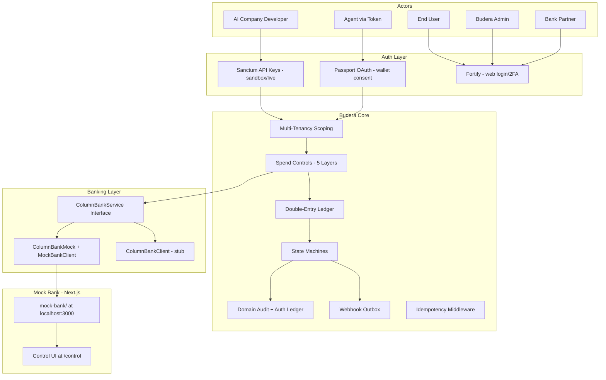
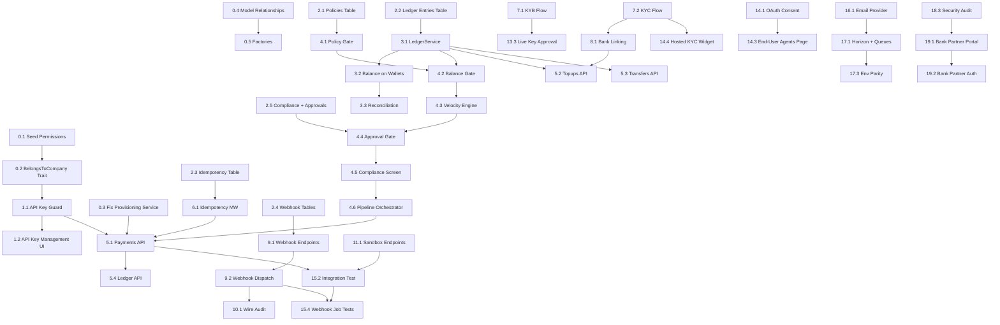

# Budera — Hyper-Detailed System Build Plan

The codebase has scattered partial work across OAuth, state machines, mock bank, audit, and onboarding. This plan sequences everything into a **dependency-correct order** where each step ships working, tested code. Steps are **vertical slices**: migration + model + service + controller + test in one go. 

> **Build complete (2026-03-27):** Full codebase audit performed against strategy docs. All 48 steps across 19 phases completed and verified. 345 tests pass (1413 assertions, 3 skipped postgres-only). Final deliverables: bank partner read-only portal (4 pages + auth boundary), hosted KYC identity verification widget, end-user "My Agents" page with activity feed, Laravel Horizon queue workers (5 named supervisors), Resend email integration, comprehensive security audit (21 tests covering tenant isolation, sandbox/live, key hashing, CORS, rate limiting, CSRF, architecture), Postgres concurrency tests, error catalog behavioral tests (23 tests), webhook job execution tests (9 tests), and full E2E payment path with outbound webhook delivery verification.

**Architecture summary from the docs:**

---

## Audit Findings (2026-03-27)

### Status Corrections Applied

| Step                    | Was           | Now         | Evidence                                                                                                                                                                                                                                                                                                   |
| ----------------------- | ------------- | ----------- | ---------------------------------------------------------------------------------------------------------------------------------------------------------------------------------------------------------------------------------------------------------------------------------------------------------- |
| 11.1 Sandbox Simulation | `in_progress` | `completed` | All 4 endpoints in [SimulationController](app/Http/Controllers/Api/V1/Sandbox/SimulationController.php), [EnsureSandboxEnvironment](app/Http/Middleware/EnsureSandboxEnvironment.php) blocks live keys, tested in [SandboxSimulationTest](tests/Feature/Api/SandboxSimulationTest.php)                     |
| 13.2 Admin Companies    | `pending`     | `completed` | [Admin/CompanyController](app/Http/Controllers/Admin/CompanyController.php) with freeze/unfreeze, Inertia pages at [admin/companies/](resources/js/pages/admin/companies/), tested in [Phase13AdminPortalTest](tests/Feature/Admin/Phase13AdminPortalTest.php)                                             |
| 13.3 Live Key Approval  | `pending`     | `completed` | [Admin/LiveAccessController](app/Http/Controllers/Admin/LiveAccessController.php), [admin/live-access/index.tsx](resources/js/pages/admin/live-access/index.tsx), tested in Phase13AdminPortalTest                                                                                                         |
| 13.4 Compliance Flags   | `pending`     | `completed` | [Admin/ComplianceFlagController](app/Http/Controllers/Admin/ComplianceFlagController.php), [admin/compliance/](resources/js/pages/admin/compliance/), tested in Phase13AdminPortalTest                                                                                                                     |
| 14.1 OAuth Consent      | `pending`     | `completed` | [oauth/authorize.tsx](resources/js/pages/oauth/authorize.tsx) includes agent name, company logo, scopes in plain language, policy preview, "What you're allowing / NOT allowing" sections                                                                                                                  |
| 14.2 Hosted Bank Link   | `pending`     | `completed` | [bank-link/session.tsx](resources/js/pages/bank-link/session.tsx) with step machine (credentials -> verify -> success/locked/expired), [BankLinkSessionController](app/Http/Controllers/BankLinkSessionController.php), tested in [Phase14BankLinkHostedTest](tests/Feature/Phase14BankLinkHostedTest.php) |
| 16.2 Notifications      | `pending`     | `completed` | All 11 notification classes in [app/Notifications/Transactional/](app/Notifications/Transactional/), tested in [TransactionalNotificationsTest](tests/Feature/Notifications/TransactionalNotificationsTest.php) and across admin/KYC/freeze tests                                                          |
| 17.2 CI                 | `pending`     | `completed` | [.github/workflows/ci.yml](.github/workflows/ci.yml) with Pest + Pint + ESLint + Prettier + types:check + npm build                                                                                                                                                                                        |
| 18.1 API Docs           | `pending`     | `completed` | 8 hand-maintained pages in [resources/docs/api/](resources/docs/api/), rendered via [DocsController](app/Http/Controllers/DocsController.php) + [Docs/Show.tsx](resources/js/pages/Docs/Show.tsx), config in [config/docs.php](config/docs.php)                                                            |
| 18.2 Rate Limiting      | `pending`     | `completed` | `throttle:api-company` in [routes/api.php](routes/api.php), tier-driven config in [config/budera.php](config/budera.php), `ApiErrorResponse::json('rate_limit_exceeded')` with Retry-After in [AppServiceProvider](app/Providers/AppServiceProvider.php)                                                   |

### Gaps Found Against Strategy Docs

| Gap                                                          | Source                                                                                                      | Severity | New Step     |
| ------------------------------------------------------------ | ----------------------------------------------------------------------------------------------------------- | -------- | ------------ |
| Bank partner portal (read-only tx, reconciliation, KYB docs) | [dev-timeline Section 15](docs/budera-dev-timeline.md)                                                      | Medium   | 19.1, 19.2   |
| End-user "My Agents" + activity feed                         | [dev-timeline Section 15](docs/budera-dev-timeline.md), [strategy Section 02](docs/budera-strategy-full.md) | Medium   | 14.3         |
| Hosted KYC widget (user-facing, like bank-link widget)       | [dev-timeline Section 10](docs/budera-dev-timeline.md)                                                      | Medium   | 14.4         |
| Horizon not installed (tech-stack says Redis + Horizon)      | [tech-stack Section 18](docs/tech-stack.md)                                                                 | High     | 17.1 updated |
| Webhook job execution tests thin                             | Audit                                                                                                       | Low      | 15.4         |
| Concurrency tests use SQLite not Postgres                    | Audit                                                                                                       | Medium   | 15.1 updated |
| E2E test lacks outbound webhook verification                 | Audit                                                                                                       | Low      | 15.2 updated |

### What IS Complete (Mock Bank included)

The **mock bank** at [mock-bank/](mock-bank/) is a full Next.js app with:

- Control UI at `/control` (accounts, transfers, KYC list, settle-now, fail-next toggles, ACH return)
- All rails: ACH push/pull, wire, SWIFT, FedNow/realtime, book transfer, check
- KYC simulator with configurable delays/rejection
- Webhooks to Laravel with HMAC signing
- In-memory ledger, env-tunable delays
- Documented in [docs/mock-bank.md](docs/mock-bank.md)
- Vitest tests for store + signing

**UI inventory (33 Inertia pages):** dashboard, onboarding, bank-link/session, oauth/authorize, payment-approvals/show, Docs/Show, 7 auth pages, 4 settings pages, 5 company pages (settings, api-keys, oauth-apps, webhooks, wallets/index/show/policy), 7 admin pages (companies/index/show, kyb-reviews/index/show, live-access/index, compliance/index/show, partner-banks).

**Component library (50 components):** full shadcn/ui set + app shell, test-mode-banner, two-factor-setup-modal, etc.

---

## Phase 0 — Foundation Fixes (refactor what's scattered) -- COMPLETED

These fix structural issues in existing code that block everything downstream.

### Step 0.1 — Seed the permission matrix properly -- COMPLETED

**What exists:** `RoleSeeder` is empty. `CompanyObserver` creates `company_owner`/`company_developer` per company. `budera_admin` is a column, not a role. No `Permission` records exist.

**What to build:**

- Fill `RoleSeeder` with all 6 canonical roles from [tech-stack.md](docs/tech-stack.md): `budera_admin`, `company_owner`, `company_developer`, `end_user`, `bank_partner`, `agent`
- Seed granular permissions per the timeline section 02 matrix (e.g. `company.manage`, `keys.create`, `keys.view`, `wallets.manage`, `wallets.view`, `payments.create`, `payments.view`, `admin.kyb.approve`, `admin.freeze`, `admin.live-keys`)
- Assign permissions to roles in the seeder
- Keep `is_budera_admin` column as a fast-check but also assign the Spatie `budera_admin` role for consistency
- Run `DatabaseSeeder` calling `RoleSeeder` first
- Test: seeder runs, roles exist, permissions assigned

**Files:** [database/seeders/RoleSeeder.php](database/seeders/RoleSeeder.php), [database/seeders/DatabaseSeeder.php](database/seeders/DatabaseSeeder.php)

### Step 0.2 — BelongsToCompany trait + global scope -- COMPLETED

**What to build:**

- Create `app/Concerns/BelongsToCompany.php` trait: adds `company()` BelongsTo, boots a `CompanyScope` global scope
- Create `app/Scopes/CompanyScope.php`: applies `where company_id = X` from request context
- Apply trait to: `WalletAccount`, `Payment`, `Topup`, `Transfer`, `BankLink`, `ApiKey`, `KybReview`, `WebhookOutbox`
- Add `withoutCompanyScope()` helper for admin queries
- Middleware: `ResolveCompanyContext` sets company from API key, Passport token, or web session
- Test: model queries are automatically scoped; admin can bypass

### Step 0.3 — Fix WalletProvisioningService to use ColumnBankService interface -- COMPLETED

### Step 0.4 — Add missing model relationships -- COMPLETED

### Step 0.5 — Create missing model factories -- COMPLETED

**Result:** 20 factories in [database/factories/](database/factories/) covering all domain models.

---

## Phase 1 — Sanctum API Keys (developer auth for the public API) -- COMPLETED

### Step 1.1 — ApiKey model as custom guard -- COMPLETED

**Built:** Custom `api-key` guard in [config/auth.php](config/auth.php), [ApiKeyGuard](app/Auth/ApiKeyGuard.php), [CheckApiKeyAbility](app/Http/Middleware/CheckApiKeyAbility.php). Reads `Authorization: Bearer sk_sandbox_...`, hashes, looks up `api_keys`, checks not revoked, resolves company + environment.

### Step 1.2 — API key management endpoints + dashboard page -- COMPLETED

**Built:** [CompanyApiKeyController](app/Http/Controllers/CompanyApiKeyController.php) (index/store/revoke/rotate), [company/api-keys.tsx](resources/js/pages/company/api-keys.tsx), live keys gated by `company.live_enabled_at`.

---

## Phase 2 — Missing Schema + Migrations -- COMPLETED

All 5 steps completed. Tables: `policies`, `ledger_entries`, `idempotency_keys`, `webhook_endpoints`, `webhook_deliveries`, `compliance_flags`, `approval_requests`.

---

## Phase 3 — Ledger System -- COMPLETED

### Step 3.1 — LedgerService -- COMPLETED

**Built:** [LedgerService](app/Services/Ledger/LedgerService.php) with debit/credit/reversal, Postgres transactions, `SELECT ... FOR UPDATE` row locking, balance_after chain.

### Step 3.2 — balance_cents on wallet_accounts -- COMPLETED

### Step 3.3 — Reconciliation command -- COMPLETED

**Built:** `php artisan ledger:reconcile`, scheduled daily in [routes/console.php](routes/console.php).

---

## Phase 4 — Spend Controls Pipeline -- COMPLETED

All 6 layers built and tested: [PolicyGate](app/Services/SpendControls/PolicyGate.php), [BalanceGate](app/Services/SpendControls/BalanceGate.php), [VelocityEngine](app/Services/SpendControls/VelocityEngine.php), [ApprovalGate](app/Services/SpendControls/ApprovalGate.php), [ComplianceScreen](app/Services/SpendControls/ComplianceScreen.php), [SpendControlsPipeline](app/Services/SpendControls/SpendControlsPipeline.php).

---

## Phase 5 — Core Money Movement APIs -- COMPLETED

All 4 APIs built with full vertical slices: Payments, Topups, Transfers, Ledger history. Controllers, services, form requests, resources, policies, routes, and tests.

---

## Phase 6 — Idempotency Middleware -- COMPLETED

[EnsureIdempotency](app/Http/Middleware/EnsureIdempotency.php) + `php artisan idempotency:prune`.

---

## Phase 7 — KYC / KYB Flows -- COMPLETED

### Step 7.1 — KYB review flow -- COMPLETED

### Step 7.2 — KYC flow + automatic partner bank account creation -- COMPLETED

---

## Phase 8 — Bank Linking Flow -- COMPLETED

[BankLinkService](app/Contracts/BankLink/BankLinkService.php) interface + [MockBankLinkService](app/Services/BankLink/MockBankLinkService.php), micro-deposits, 3-strike lockout, authorization ledger on verify.

---

## Phase 9 — Webhook System -- COMPLETED

### Step 9.1 — Webhook endpoint management -- COMPLETED

### Step 9.2 — Webhook dispatch pipeline -- COMPLETED

**Built:** [WebhookFanOutService](app/Services/Webhooks/WebhookFanOutService.php), [WebhookSubscriptionFanout](app/Services/Webhooks/WebhookSubscriptionFanout.php), [ProcessWebhookDeliveryJob](app/Jobs/ProcessWebhookDeliveryJob.php), [DispatchWebhookOutboxJob](app/Jobs/DispatchWebhookOutboxJob.php), HMAC signing, exponential backoff retries.

---

## Phase 10 — Domain Audit + Authorization Ledger -- COMPLETED

### Step 10.1 — Wire audit into all flows -- COMPLETED

### Step 10.2 — Authorization ledger for ACH -- COMPLETED

---

## Phase 11 — Sandbox Simulation Endpoints -- COMPLETED

### Step 11.1 — Sandbox-only API routes -- COMPLETED

**Built:** [EnsureSandboxEnvironment](app/Http/Middleware/EnsureSandboxEnvironment.php) blocks live keys. [SimulationController](app/Http/Controllers/Api/V1/Sandbox/SimulationController.php) with all 4 endpoints: `settlement`, `return` (paymentReturn), `kyc-approve`, `microdeposit`. Tested in [SandboxSimulationTest](tests/Feature/Api/SandboxSimulationTest.php) and [SandboxSimulationErrorsTest](tests/Feature/Api/Errors/SandboxSimulationErrorsTest.php).

---

## Phase 12 — Company Dashboard UI (Inertia/React) -- COMPLETED

All dashboard pages built: [dashboard.tsx](resources/js/pages/dashboard.tsx) with wallet overview + deferred props, [company/wallets/](resources/js/pages/company/wallets/) (index + show + policy), [company/webhooks.tsx](resources/js/pages/company/webhooks.tsx), [test-mode-banner.tsx](resources/js/components/test-mode-banner.tsx) with environment toggle.

---

## Phase 13 — Budera Admin Portal -- COMPLETED

### Step 13.1 — KYB review queue -- COMPLETED (planned in Step 7.1)

### Step 13.2 — Company management -- COMPLETED

**Built:** [admin/companies/index.tsx](resources/js/pages/admin/companies/index.tsx) + [show.tsx](resources/js/pages/admin/companies/show.tsx), [Admin/CompanyController](app/Http/Controllers/Admin/CompanyController.php) with freeze/unfreeze that transitions all company wallets + fires webhooks + sends [AccountFrozenNotification](app/Notifications/Transactional/AccountFrozenNotification.php). Tested in [Phase13AdminPortalTest](tests/Feature/Admin/Phase13AdminPortalTest.php).

### Step 13.3 — Live key approval flow -- COMPLETED

**Built:** [Admin/LiveAccessController](app/Http/Controllers/Admin/LiveAccessController.php), [admin/live-access/index.tsx](resources/js/pages/admin/live-access/index.tsx). Approve sets `company.live_enabled_at`, sends [LiveAccessApprovedNotification](app/Notifications/Transactional/LiveAccessApprovedNotification.php).

### Step 13.4 — Compliance flags dashboard -- COMPLETED

**Built:** [Admin/ComplianceFlagController](app/Http/Controllers/Admin/ComplianceFlagController.php), [admin/compliance/index.tsx](resources/js/pages/admin/compliance/index.tsx) + [show.tsx](resources/js/pages/admin/compliance/show.tsx).

---

## Phase 14 — End-User Flows

### Step 14.1 — Rich OAuth consent screen -- COMPLETED

**Built:** [oauth/authorize.tsx](resources/js/pages/oauth/authorize.tsx) with company logo, agent name, requested scopes in plain language, wallet preview, policy preview (limits/categories/approvals/blocked payees/business hours), "What you're allowing" / "What you're NOT allowing" sections, Authorize/Deny forms.

### Step 14.2 — Hosted bank linking widget -- COMPLETED

**Built:** [bank-link/session.tsx](resources/js/pages/bank-link/session.tsx) with full step machine (credentials -> microdeposit_sent -> verify -> success/locked/expired), [BankLinkSessionController](app/Http/Controllers/BankLinkSessionController.php), [ResolveBankLinkSession](app/Http/Middleware/ResolveBankLinkSession.php) middleware. Public page, session-token-authenticated. Tested in [Phase14BankLinkHostedTest](tests/Feature/Phase14BankLinkHostedTest.php).

### Step 14.3 — End-user "My Agents" page + activity feed -- PENDING

**Gap found in audit:** The dev-timeline Section 15 specifies an **end-user app** portal with: agent access management, activity feed, transaction history, spending summaries. Currently end users only have scattered touchpoints (bank-link widget, payment approval, oauth-connections). There is no unified "My Agents" page.

**What to build:**

- `resources/js/pages/user/agents/index.tsx` -- list all agents the user has authorized via OAuth, grouped by AI company
  - Per-agent: name, company, scopes granted, spend to date, last active, balance in agent's wallet
  - Revoke access button (calls Passport token revocation)
  - Link to view agent's transaction history
- `resources/js/pages/user/agents/show.tsx` -- single agent detail
  - Transaction history (ledger entries for this agent's wallet scoped to this user's topups/payments)
  - Active policy summary
  - Connected bank link status
  - Revoke / modify permissions
- `resources/js/pages/user/activity.tsx` -- unified activity feed across all agents
  - Chronological feed: topups, payments, approvals, bank link events
  - Filter by agent, date range, type
- New controller: `UserAgentController` -- resolves agents from user's OAuth grants + wallet relationships
- Routes under authenticated user context (not company dashboard)
- Consider lightweight layout variant for end-user pages (simpler chrome than company dashboard)
- Test: page renders with correct agent data, revoke works, activity shows cross-agent history

**Files:** New pages in `resources/js/pages/user/`, new controller, route additions

### Step 14.4 — Hosted KYC widget -- PENDING

**Gap found in audit:** The dev-timeline Section 10 specifies a hosted KYC widget (similar to the bank-link hosted widget). Currently KYC is submitted via API (`POST /api/v1/wallet/accounts/{id}/kyc`) with no user-facing hosted page. The bank-link widget pattern works well and should be replicated.

**What to build:**

- `resources/js/pages/kyc/session.tsx` -- Budera-hosted page for identity verification
  - Step 1: user enters name, DOB, address, last 4 SSN (identity fields from [MockKycProvider](app/Services/Kyc/MockKycProvider.php))
  - Step 2: "Verifying your identity..." loading state while KYC processes
  - Step 3: Success ("Your identity is verified -- your agent's wallet is now active") or failure states
  - Sandbox: instant approval (configurable via `config/budera.php`)
- `KycSessionController` -- similar to [BankLinkSessionController](app/Http/Controllers/BankLinkSessionController.php)
  - `show`: render the hosted page with session data
  - `submit`: process identity data, call KycProvider
- Session token generated by API (`POST /api/v1/kyc/session`) and returned to AI company
- Route: `GET /kyc/{sessionToken}` -- public page, token-authenticated
- Test: full flow renders, sandbox instant approval, error states

**Files:** New page, new controller, route additions

---

## Phase 15 — Testing Strategy

### Step 15.1 — Concurrency tests on Postgres -- PENDING

**Audit finding:** Current concurrency tests in [BookTransferAndIdempotencyConcurrencyTest](tests/Concurrency/BookTransferAndIdempotencyConcurrencyTest.php) use SQLite, which does not support `SELECT ... FOR UPDATE` row locking. The tests validate the general concept but not the actual Postgres locking behavior that protects against double-debits in production.

**What to build:**

- Rewrite concurrency tests to require Postgres (`->markTestSkipped` if SQLite)
- Test: two simultaneous debits against same wallet via parallel HTTP requests to `POST /api/v1/payments` -- only one succeeds if balance insufficient for both
- Test: two simultaneous payments with same `Idempotency-Key` -- only one processes, second gets cached response
- Test: concurrent topup settlement webhooks for the same topup -- idempotent, only one ledger credit
- Use `pcntl_fork` or parallel artisan commands against the Postgres test database
- Verify `SELECT ... FOR UPDATE` actually blocks the second transaction

**Files:** Update [tests/Concurrency/](tests/Concurrency/)

### Step 15.2 — Full payment path integration test + outbound webhooks -- PENDING

**Audit finding:** [FullAgentMoneyPathTest](tests/Feature/E2E/FullAgentMoneyPathTest.php) exists and covers inbound mock-bank webhooks + ledger, but does **not** verify outbound tenant webhook deliveries to company endpoints.

**What to build:**

- Extend E2E test to also: register a webhook endpoint for the company, verify `WebhookDelivery` records created for each state transition (payment.approved, payment.settled, topup.settled, etc.)
- Verify HMAC signatures on delivery payloads match the endpoint secret
- Verify webhook event types match `config('budera.outbound_webhook_events')`
- This makes it THE definitive test for the entire system including the outbound notification pipeline

**Files:** Update [tests/Feature/E2E/FullAgentMoneyPathTest.php](tests/Feature/E2E/FullAgentMoneyPathTest.php)

### Step 15.3 — Error catalog behavioral tests -- PENDING

**Audit finding:** [ApiErrorCodesInventoryTest](tests/Architecture/ApiErrorCodesInventoryTest.php) verifies config-to-code alignment (structural) but does not exercise each error code via HTTP.

**What to build:**

- For each error code in [config/api_errors.php](config/api_errors.php), at least one test that triggers the error via HTTP and asserts the response shape `{ error: { code, message, detail, layer } }`
- Organized by category: auth errors, spend control layers (L1-L5), validation errors, sandbox-only errors, rate limit errors
- Build on existing partial coverage in [tests/Feature/Api/Errors/](tests/Feature/Api/Errors/)

**Files:** New tests in `tests/Feature/Api/Errors/`

### Step 15.4 — Webhook job execution tests -- PENDING (NEW)

**Audit finding:** [ProcessWebhookDeliveryJob](app/Jobs/ProcessWebhookDeliveryJob.php) and [DispatchWebhookOutboxJob](app/Jobs/DispatchWebhookOutboxJob.php) are tested for queue name routing in [JobQueueNamesTest](tests/Feature/Queue/JobQueueNamesTest.php) but their actual execution paths (HTTP delivery, retry on failure, max attempts, HMAC signing) are not individually tested.

**What to build:**

- Test: `ProcessWebhookDeliveryJob` makes HTTP POST with correct HMAC signature header
- Test: failed delivery increments attempts, schedules retry with exponential backoff
- Test: max attempts reached transitions delivery to `failed`
- Test: `DispatchWebhookOutboxJob` fans out to all matching endpoint subscriptions
- Test: delivery to non-responsive URL is handled gracefully
- Use `Http::fake()` for controlled response simulation

**Files:** New test `tests/Feature/Webhooks/WebhookJobExecutionTest.php`

---

## Phase 16 — Transactional Email

### Step 16.1 — Finalize email provider for production -- PENDING

**Current state:** Mailpit is configured in [compose.yaml](compose.yaml) for local dev via Sail. All 11 notification classes exist and work. What remains is choosing the production provider.

**What to build:**

- Choose between Resend (recommended for DX) or Postmark (recommended for deliverability)
- Add provider API key to `.env.example` with documentation comment
- Configure `config/mail.php` mailer entry for the chosen provider
- Add `config/services.php` entry with env references
- Verify `MAIL_MAILER` switching works between `mailpit` (local) and the production provider
- Test: send test email via chosen provider in staging

### Step 16.2 — All transactional email notifications -- COMPLETED

**Built:** All 11 notification classes in [app/Notifications/Transactional/](app/Notifications/Transactional/):

- `KycApprovedNotification`, `KycRejectedNotification`, `KycNeedsInfoNotification`
- `KybApprovedNotification`, `KybRejectedNotification`
- `MicrodepositInstructionsNotification`
- `PaymentHeldForApprovalNotification` (with approval link)
- `AccountFrozenNotification`, `LowBalanceNotification`
- `LiveAccessApprovedNotification`
- `CompanyInvitationNotification`

All queued via [RoutesMailToNotificationsQueue](app/Notifications/Transactional/Concerns/RoutesMailToNotificationsQueue.php) to `budera.queues.notifications`. Tested across [TransactionalNotificationsTest](tests/Feature/Notifications/TransactionalNotificationsTest.php) and related feature tests.

---

## Phase 17 — Infra Baseline

### Step 17.1 — Install Horizon + queue worker configuration -- PENDING

**Current state:** Queue names defined in [config/budera.php](config/budera.php) (`default`, `payments`, `webhooks`, `notifications`, `compliance`). Jobs route to named queues correctly (tested in [JobQueueNamesTest](tests/Feature/Queue/JobQueueNamesTest.php)). **Missing:** Horizon is not installed -- no `config/horizon.php`, no dashboard, no worker supervision.

**What to build:**

- `composer require laravel/horizon`
- `php artisan horizon:install` -- generates config + dashboard route
- Configure `config/horizon.php` with supervisor groups:
  - `payments-supervisor`: queue `payments`, max processes 3, balance `simple`
  - `webhooks-supervisor`: queue `webhooks`, max processes 2, balance `auto`
  - `notifications-supervisor`: queue `notifications`, max processes 1
  - `compliance-supervisor`: queue `compliance`, max processes 1
  - `default-supervisor`: queue `default`, max processes 2
- Gate Horizon dashboard to `budera_admin` users in `HorizonServiceProvider`
- Add Horizon to [compose.yaml](compose.yaml) as a worker service
- Update `.env.example` with `QUEUE_CONNECTION=redis` documentation
- Test: Horizon dashboard accessible to admin, jobs process through supervisors

**Files:** `config/horizon.php`, `app/Providers/HorizonServiceProvider.php`, [compose.yaml](compose.yaml)

### Step 17.2 — GitHub Actions CI -- COMPLETED

**Built:** [.github/workflows/ci.yml](.github/workflows/ci.yml) runs on push/PR to develop/main/master: PHP 8.5 + Composer + Pint lint check + npm ci + ESLint + Prettier + types:check + npm build + `php artisan test --compact`.

### Step 17.3 — Environment parity -- PENDING

**Current state:** [compose.yaml](compose.yaml) exists with Sail (laravel.test, pgsql, redis, mailpit). `.env.example` exists but needs completeness audit.

**What to build:**

- Audit `.env.example` against all `config()` references -- ensure every env var has a documented entry
- Verify mock-bank env vars are documented: `MOCK_BANK_BASE_URL`, `MOCK_BANK_SECRET`, `MOCK_BANK_WEBHOOK_SECRET`
- Verify Budera-specific vars: `BUDERA_AUDIT_RSA_PRIVATE_KEY`, `BUDERA_AUDIT_HMAC_KEY`, `BUDERA_ACH_AUTH_TEXT`
- Add mock-bank to compose.yaml as a service (Node.js container alongside Laravel)
- Document local dev startup sequence in README or `docs/local-setup.md`
- Staging config: document required production env vars for deployment

**Files:** [.env.example](.env.example), [compose.yaml](compose.yaml)

---

## Phase 18 — Polish + Ship Readiness

### Step 18.1 — Hand-maintained API documentation + error catalog -- COMPLETED

**Built:** 8 pages in [resources/docs/api/](resources/docs/api/) (overview, authentication, quickstart, endpoints, errors, idempotency, webhooks, security). Rendered via [DocsController](app/Http/Controllers/DocsController.php) + [Docs/Show.tsx](resources/js/pages/Docs/Show.tsx). Error catalog in [config/api_errors.php](config/api_errors.php) with standardized shape `{ error: { code, message, detail, layer } }` via [ApiErrorResponse](app/Http/Responses/ApiErrorResponse.php).

### Step 18.2 — Rate limiting per company -- COMPLETED

**Built:** `throttle:api-company` middleware on all `/api/v1` routes in [routes/api.php](routes/api.php). Tier-driven limits from [config/budera.php](config/budera.php) (`api_rate_limits.default/growth/enterprise`). Company `api_rate_limit_tier` column. `429` response via `ApiErrorResponse::json('rate_limit_exceeded')` with `Retry-After` header in [bootstrap/app.php](bootstrap/app.php).

### Step 18.3 — Final security audit -- PENDING

**What to verify:**

- All routes have correct middleware (audit via [ApiV1RoutesMiddlewareAuditTest](tests/Architecture/ApiV1RoutesMiddlewareAuditTest.php) -- verify it covers all routes)
- No tenant data leaks: test with two companies accessing each other's resources (partially covered by [CrossCompanyResourceIsolationTest](tests/Feature/Api/CrossCompanyResourceIsolationTest.php) -- extend coverage)
- Sandbox/live isolation: sandbox key cannot access live data, live key cannot access sandbox
- API keys properly hashed (`key_hash` column, not stored plain -- verified in [ApiKeyHashingTest](tests/Feature/Api/ApiKeyHashingTest.php))
- Sensitive columns encrypted (webhook secrets, bank routing hashes, partner bank credentials)
- CORS configured correctly for API (check `config/cors.php`)
- CSRF on web routes (verify Inertia middleware stack)
- No `env()` calls outside config files
- Rate limiting cannot be bypassed by rotating API keys

---

## Phase 19 — Bank Partner Portal -- PENDING (NEW)

### Step 19.1 — Bank partner read-only portal

**Gap found in audit:** The dev-timeline Section 15 defines **four UI portals** including a **Bank partner** portal for sponsor bank users. This portal is entirely unbuilt. The `bank_partner` role exists in the RoleSeeder but has no dedicated UI surface.

**What to build:**

- `resources/js/pages/bank-partner/dashboard.tsx` -- overview: total accounts under program, aggregate volume, compliance status
- `resources/js/pages/bank-partner/transactions.tsx` -- read-only paginated transaction view across all companies
  - Filter by company, date range, amount, status
  - Export to CSV for reconciliation
- `resources/js/pages/bank-partner/kyb-documents.tsx` -- read-only KYB submission viewer
  - Company name, submission date, documents, review status
  - No approve/reject actions (that's admin-only)
- `resources/js/pages/bank-partner/reconciliation.tsx` -- reconciliation report
  - Per-company: expected vs actual balances, ledger totals, mismatches
  - Uses `LedgerService::balanceForAccount` vs cached balance comparison
  - Export signed reconciliation report
- Controller: `BankPartner/DashboardController`, `BankPartner/TransactionController`, `BankPartner/KybDocumentController`, `BankPartner/ReconciliationController`
- All controllers verify `bank_partner` role via policy/middleware
- Routes: `bank-partner/`* under authenticated + `bank_partner` role middleware
- Dedicated layout variant (read-only, no edit actions, bank branding placeholder)
- Test: bank_partner can access, company_owner cannot, all data read-only, export works

**Files:** New pages in `resources/js/pages/bank-partner/`, new controllers in `app/Http/Controllers/BankPartner/`, route additions

### Step 19.2 — Bank partner auth guard + role enforcement

**What to build:**

- Middleware: `EnsureBankPartner` (or reuse role-based middleware with `bank_partner` check)
- Ensure `bank_partner` users are created separately from company users (they should not have a `company_id` -- they see across all companies)
- Bank partner invitation flow: Budera admin invites a bank partner user
- Bank partner users should NOT see the company dashboard, admin portal, or any mutation endpoints
- Test: strict role boundary enforcement, no cross-portal access

**Files:** New middleware or policy, invitation flow, route group isolation

---

## Dependency Graph

---

## Execution Order (recommended)

Phases 0-13 are **completed**. Remaining work in priority order:

1. **Phase 15** (15.1 -> 15.2 -> 15.3 -> 15.4) -- ~3 days -- Testing hardening (concurrency on Postgres, E2E + outbound webhooks, error catalog behavioral tests, webhook job tests)
2. **Phase 17.1** -- ~0.5 day -- Install Horizon + configure queue supervisors
3. **Phase 16.1** -- ~0.5 day -- Finalize production email provider
4. **Phase 17.3** -- ~0.5 day -- Environment parity audit
5. **Phase 14.3** -- ~2 days -- End-user "My Agents" page + activity feed
6. **Phase 14.4** -- ~1 day -- Hosted KYC widget
7. **Phase 18.3** -- ~1.5 days -- Final security audit
8. **Phase 19** (19.1 -> 19.2) -- ~3 days -- Bank partner portal (read-only UI + auth boundary)

**Remaining estimated: ~12-13 working days**

### Completed phases summary

| Phase               | Steps                                 | Status        |
| ------------------- | ------------------------------------- | ------------- |
| 0 - Foundation      | 0.1-0.5                               | COMPLETED     |
| 1 - API Keys        | 1.1-1.2                               | COMPLETED     |
| 2 - Schema          | 2.1-2.5                               | COMPLETED     |
| 3 - Ledger          | 3.1-3.3                               | COMPLETED     |
| 4 - Spend Controls  | 4.1-4.6                               | COMPLETED     |
| 5 - Money APIs      | 5.1-5.4                               | COMPLETED     |
| 6 - Idempotency     | 6.1                                   | COMPLETED     |
| 7 - KYC/KYB         | 7.1-7.2                               | COMPLETED     |
| 8 - Bank Linking    | 8.1                                   | COMPLETED     |
| 9 - Webhooks        | 9.1-9.2                               | COMPLETED     |
| 10 - Audit          | 10.1-10.2                             | COMPLETED     |
| 11 - Sandbox        | 11.1                                  | COMPLETED     |
| 12 - Dashboard UI   | 12.1-12.6                             | COMPLETED     |
| 13 - Admin Portal   | 13.1-13.4                             | COMPLETED     |
| 14 - End-User Flows | 14.1-14.2 done, 14.3-14.4 pending     | PARTIAL       |
| 15 - Testing        | 15.1-15.4                             | PENDING       |
| 16 - Email          | 16.1 pending, 16.2 done               | PARTIAL       |
| 17 - Infra          | 17.1 pending, 17.2 done, 17.3 pending | PARTIAL       |
| 18 - Polish         | 18.1-18.2 done, 18.3 pending          | PARTIAL       |
| 19 - Bank Partner   | 19.1-19.2                             | PENDING (NEW) |

### Mock bank status

The mock bank at [mock-bank/](mock-bank/) is **complete** and operational:

- Next.js App Router with in-memory ledger
- Control UI at `/control` with settle-now, fail-next, ACH return controls
- All rails: ACH push/pull, wire, SWIFT, FedNow, book, check
- KYC simulator with configurable delays/rejection
- HMAC-signed webhooks to Laravel
- Vitest tests for store + signing helpers
- Documented in [docs/mock-bank.md](docs/mock-bank.md)

