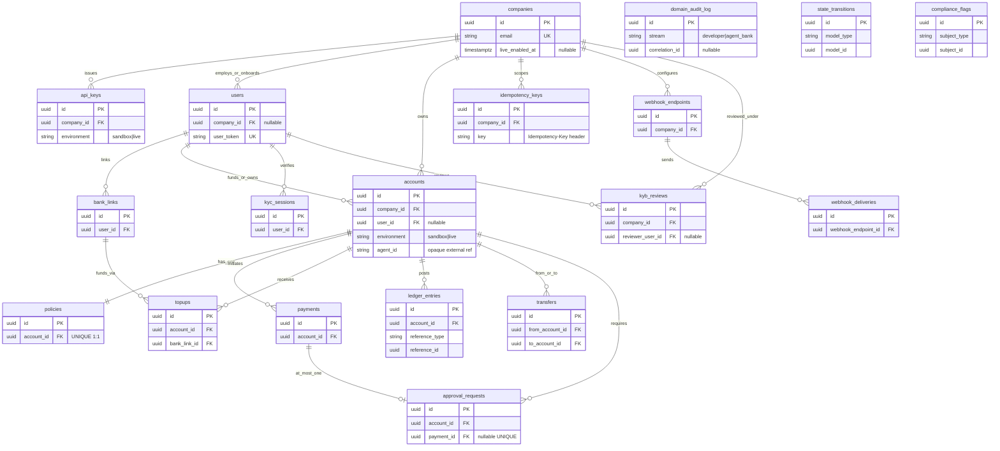

# Budera core ERD — overview (PK/FK only)

```mermaid
%% Budera core ERD — overview (PK/FK only)
erDiagram
    companies {
        uuid id PK
        string email UK
        timestamptz live_enabled_at "nullable"
    }

    api_keys {
        uuid id PK
        uuid company_id FK
        string environment "sandbox|live"
    }

    users {
        uuid id PK
        uuid company_id FK "nullable"
        string user_token UK
    }

    bank_links {
        uuid id PK
        uuid user_id FK
    }

    accounts {
        uuid id PK
        uuid company_id FK
        uuid user_id FK "nullable"
        string environment "sandbox|live"
        string agent_id "opaque external ref"
    }

    policies {
        uuid id PK
        uuid account_id FK "UNIQUE 1:1"
    }

    payments {
        uuid id PK
        uuid account_id FK
    }

    topups {
        uuid id PK
        uuid account_id FK
        uuid bank_link_id FK
    }

    transfers {
        uuid id PK
        uuid from_account_id FK
        uuid to_account_id FK
    }

    ledger_entries {
        uuid id PK
        uuid account_id FK
        string reference_type
        uuid reference_id
    }

    idempotency_keys {
        uuid id PK
        uuid company_id FK
        string key "Idempotency-Key header"
    }

    webhook_endpoints {
        uuid id PK
        uuid company_id FK
    }

    webhook_deliveries {
        uuid id PK
        uuid webhook_endpoint_id FK
    }

    domain_audit_log {
        uuid id PK
        string stream "developer|agent_bank"
        uuid correlation_id "nullable"
    }

    state_transitions {
        uuid id PK
        string model_type
        uuid model_id
    }

    kyc_sessions {
        uuid id PK
        uuid user_id FK
    }

    kyb_reviews {
        uuid id PK
        uuid company_id FK
        uuid reviewer_user_id FK "nullable"
    }

    compliance_flags {
        uuid id PK
        string subject_type
        uuid subject_id
    }

    approval_requests {
        uuid id PK
        uuid account_id FK
        uuid payment_id FK "nullable UNIQUE"
    }

    companies ||--o{ api_keys : issues
    companies ||--o{ users : employs_or_onboards
    companies ||--o{ accounts : owns
    companies ||--o{ idempotency_keys : scopes
    companies ||--o{ webhook_endpoints : configures
    companies ||--o{ kyb_reviews : reviewed_under

    users ||--o{ bank_links : links
    users ||--o{ accounts : funds_or_owns
    users ||--o{ kyc_sessions : verifies
    users ||--o{ kyb_reviews : reviews

    accounts ||--|| policies : has_one
    accounts ||--o{ payments : initiates
    accounts ||--o{ topups : receives
    accounts ||--o{ ledger_entries : posts
    accounts ||--o{ transfers : from_or_to
    accounts ||--o{ approval_requests : requires

    bank_links ||--o{ topups : funds_via

    webhook_endpoints ||--o{ webhook_deliveries : sends

    payments ||--o| approval_requests : at_most_one
```
