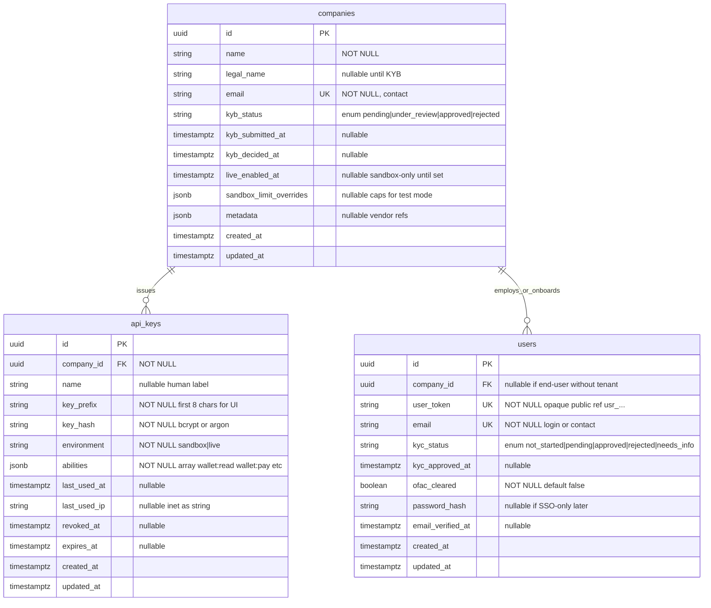

# Budera core ERD — tenancy, API keys, users (hyper-detail)

```mermaid
%% Budera core ERD — tenancy, API keys, users (hyper-detail)
erDiagram
    companies {
        uuid id PK
        string name "NOT NULL"
        string legal_name "nullable until KYB"
        string email UK "NOT NULL, contact"
        string kyb_status "enum pending|under_review|approved|rejected"
        timestamptz kyb_submitted_at "nullable"
        timestamptz kyb_decided_at "nullable"
        timestamptz live_enabled_at "nullable sandbox-only until set"
        jsonb sandbox_limit_overrides "nullable caps for test mode"
        jsonb metadata "nullable vendor refs"
        timestamptz created_at
        timestamptz updated_at
    }

    api_keys {
        uuid id PK
        uuid company_id FK "NOT NULL"
        string name "nullable human label"
        string key_prefix "NOT NULL first 8 chars for UI"
        string key_hash "NOT NULL bcrypt or argon"
        string environment "NOT NULL sandbox|live"
        jsonb abilities "NOT NULL array wallet:read wallet:pay etc"
        timestamptz last_used_at "nullable"
        string last_used_ip "nullable inet as string"
        timestamptz revoked_at "nullable"
        timestamptz expires_at "nullable"
        timestamptz created_at
        timestamptz updated_at
    }

    users {
        uuid id PK
        uuid company_id FK "nullable if end-user without tenant"
        string user_token UK "NOT NULL opaque public ref usr_..."
        string email UK "NOT NULL login or contact"
        string kyc_status "enum not_started|pending|approved|rejected|needs_info"
        timestamptz kyc_approved_at "nullable"
        boolean ofac_cleared "NOT NULL default false"
        string password_hash "nullable if SSO-only later"
        timestamptz email_verified_at "nullable"
        timestamptz created_at
        timestamptz updated_at
    }

    companies ||--o{ api_keys : issues
    companies ||--o{ users : employs_or_onboards
```
