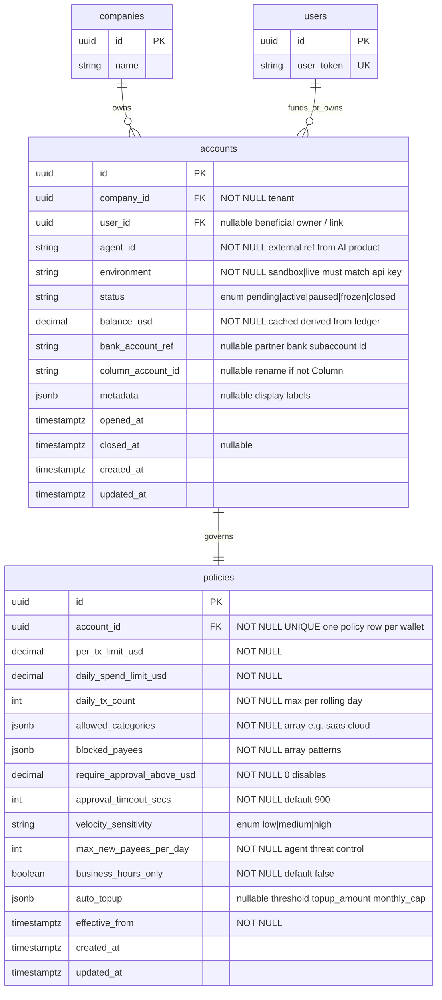

# Budera core ERD — accounts (wallets) and policies (hyper-detail)

```mermaid
%% Budera core ERD — accounts (wallets) and policies (hyper-detail)
erDiagram
    companies {
        uuid id PK
        string name
    }

    users {
        uuid id PK
        string user_token UK
    }

    accounts {
        uuid id PK
        uuid company_id FK "NOT NULL tenant"
        uuid user_id FK "nullable beneficial owner / link"
        string agent_id "NOT NULL external ref from AI product"
        string environment "NOT NULL sandbox|live must match api key"
        string status "enum pending|active|paused|frozen|closed"
        decimal balance_usd "NOT NULL cached derived from ledger"
        string bank_account_ref "nullable partner bank subaccount id"
        string column_account_id "nullable rename if not Column"
        jsonb metadata "nullable display labels"
        timestamptz opened_at
        timestamptz closed_at "nullable"
        timestamptz created_at
        timestamptz updated_at
    }

    policies {
        uuid id PK
        uuid account_id FK "NOT NULL UNIQUE one policy row per wallet"
        decimal per_tx_limit_usd "NOT NULL"
        decimal daily_spend_limit_usd "NOT NULL"
        int daily_tx_count "NOT NULL max per rolling day"
        jsonb allowed_categories "NOT NULL array e.g. saas cloud"
        jsonb blocked_payees "NOT NULL array patterns"
        decimal require_approval_above_usd "NOT NULL 0 disables"
        int approval_timeout_secs "NOT NULL default 900"
        string velocity_sensitivity "enum low|medium|high"
        int max_new_payees_per_day "NOT NULL agent threat control"
        boolean business_hours_only "NOT NULL default false"
        jsonb auto_topup "nullable threshold topup_amount monthly_cap"
        timestamptz effective_from "NOT NULL"
        timestamptz created_at
        timestamptz updated_at
    }

    companies ||--o{ accounts : owns
    users ||--o{ accounts : funds_or_owns
    accounts ||--|| policies : governs
```
