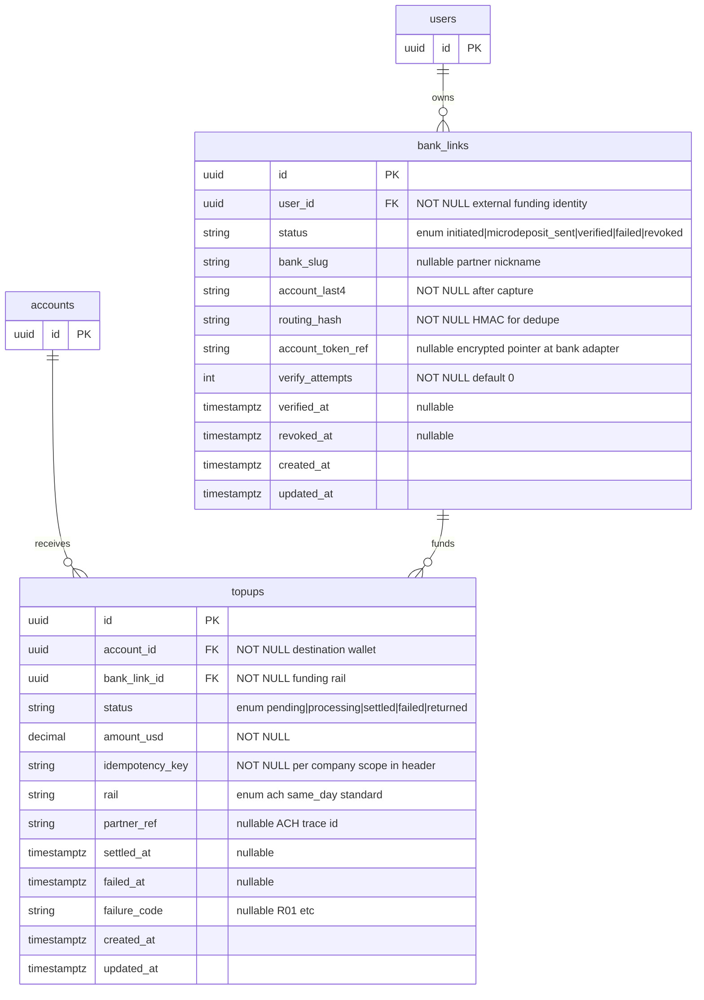

# Budera core ERD — bank links and topups (hyper-detail)

```mermaid
%% Budera core ERD — bank links and topups (hyper-detail)
erDiagram
    users {
        uuid id PK
    }

    bank_links {
        uuid id PK
        uuid user_id FK "NOT NULL external funding identity"
        string status "enum initiated|microdeposit_sent|verified|failed|revoked"
        string bank_slug "nullable partner nickname"
        string account_last4 "NOT NULL after capture"
        string routing_hash "NOT NULL HMAC for dedupe"
        string account_token_ref "nullable encrypted pointer at bank adapter"
        int verify_attempts "NOT NULL default 0"
        timestamptz verified_at "nullable"
        timestamptz revoked_at "nullable"
        timestamptz created_at
        timestamptz updated_at
    }

    accounts {
        uuid id PK
    }

    topups {
        uuid id PK
        uuid account_id FK "NOT NULL destination wallet"
        uuid bank_link_id FK "NOT NULL funding rail"
        string status "enum pending|processing|settled|failed|returned"
        decimal amount_usd "NOT NULL"
        string idempotency_key "NOT NULL per company scope in header"
        string rail "enum ach same_day standard"
        string partner_ref "nullable ACH trace id"
        timestamptz settled_at "nullable"
        timestamptz failed_at "nullable"
        string failure_code "nullable R01 etc"
        timestamptz created_at
        timestamptz updated_at
    }

    users ||--o{ bank_links : owns
    accounts ||--o{ topups : receives
    bank_links ||--o{ topups : funds
```
