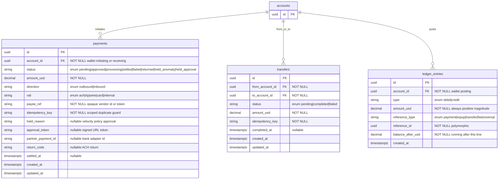

# Budera core ERD — payments, transfers, ledger (hyper-detail)

```mermaid
%% Budera core ERD — payments, transfers, ledger (hyper-detail)
erDiagram
    accounts {
        uuid id PK
    }

    payments {
        uuid id PK
        uuid account_id FK "NOT NULL wallet initiating or receiving"
        string status "enum pending|approved|processing|settled|failed|returned|held_anomaly|held_approval"
        decimal amount_usd "NOT NULL"
        string direction "enum outbound|inbound"
        string rail "enum ach|rtp|wire|card|internal"
        string payee_ref "NOT NULL opaque vendor id or token"
        string idempotency_key "NOT NULL scoped duplicate guard"
        string held_reason "nullable velocity policy approval"
        string approval_token "nullable signed URL token"
        string partner_payment_id "nullable bank adapter id"
        string return_code "nullable ACH return"
        timestamptz settled_at "nullable"
        timestamptz created_at
        timestamptz updated_at
    }

    transfers {
        uuid id PK
        uuid from_account_id FK "NOT NULL"
        uuid to_account_id FK "NOT NULL"
        string status "enum pending|completed|failed"
        decimal amount_usd "NOT NULL"
        string idempotency_key "NOT NULL"
        timestamptz completed_at "nullable"
        timestamptz created_at
        timestamptz updated_at
    }

    ledger_entries {
        uuid id PK
        uuid account_id FK "NOT NULL wallet posting"
        string type "enum debit|credit"
        decimal amount_usd "NOT NULL always positive magnitude"
        string reference_type "enum payment|topup|transfer|fee|reversal"
        uuid reference_id "NOT NULL polymorphic"
        decimal balance_after_usd "NOT NULL running after this line"
        timestamptz created_at
    }

    accounts ||--o{ payments : initiates
    accounts ||--o{ transfers : from_or_to
    accounts ||--o{ ledger_entries : posts
```
