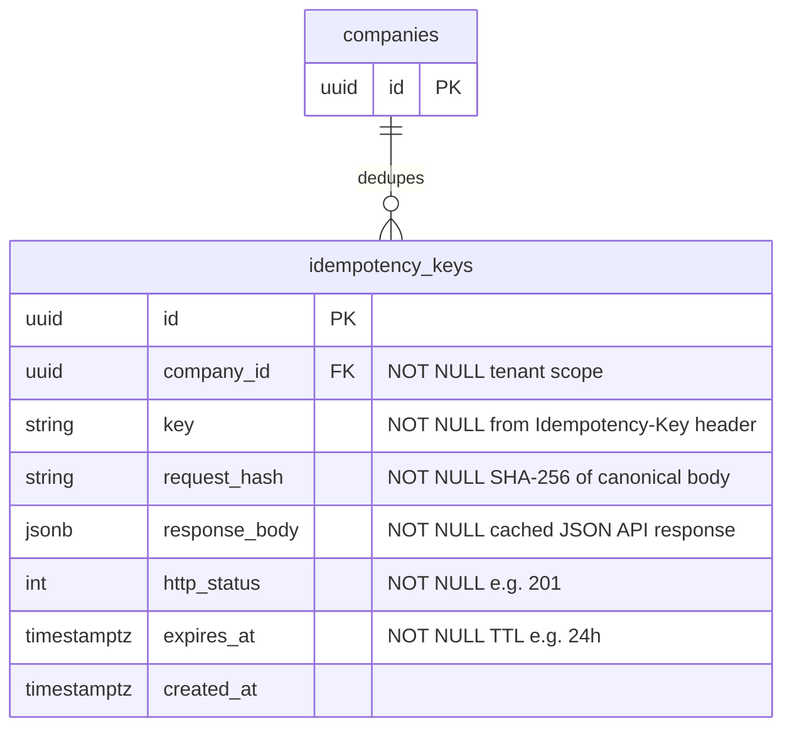

# Budera core ERD — idempotency keys (hyper-detail)

```mermaid
%% Budera core ERD — idempotency keys (hyper-detail)
erDiagram
    companies {
        uuid id PK
    }

    idempotency_keys {
        uuid id PK
        uuid company_id FK "NOT NULL tenant scope"
        string key "NOT NULL from Idempotency-Key header"
        string request_hash "NOT NULL SHA-256 of canonical body"
        jsonb response_body "NOT NULL cached JSON API response"
        int http_status "NOT NULL e.g. 201"
        timestamptz expires_at "NOT NULL TTL e.g. 24h"
        timestamptz created_at
    }

    companies ||--o{ idempotency_keys : dedupes
```
