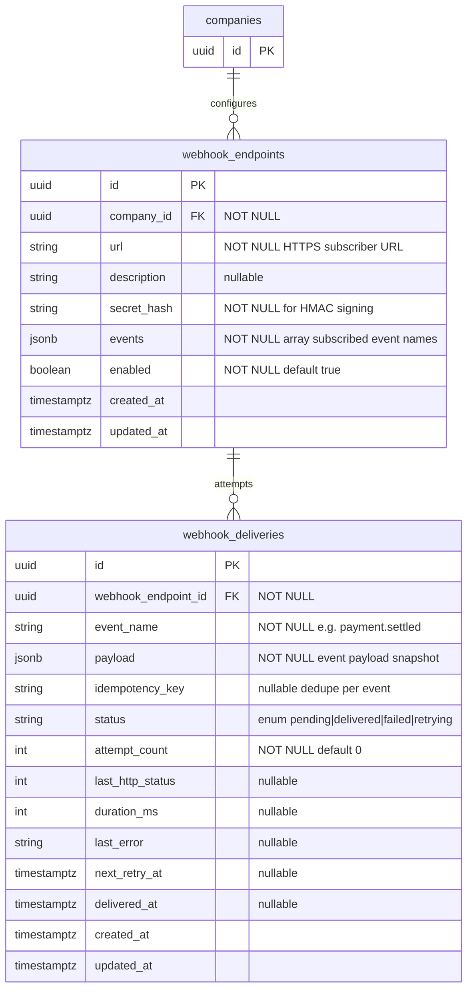

# Budera core ERD — outbound webhooks (hyper-detail)

Timeline “webhook_events” is modeled as `webhook_deliveries` (delivery log).

```mermaid
%% Budera core ERD — outbound webhooks (hyper-detail)
%% Timeline "webhook_events" modeled as webhook_deliveries (delivery log)
erDiagram
    companies {
        uuid id PK
    }

    webhook_endpoints {
        uuid id PK
        uuid company_id FK "NOT NULL"
        string url "NOT NULL HTTPS subscriber URL"
        string description "nullable"
        string secret_hash "NOT NULL for HMAC signing"
        jsonb events "NOT NULL array subscribed event names"
        boolean enabled "NOT NULL default true"
        timestamptz created_at
        timestamptz updated_at
    }

    webhook_deliveries {
        uuid id PK
        uuid webhook_endpoint_id FK "NOT NULL"
        string event_name "NOT NULL e.g. payment.settled"
        jsonb payload "NOT NULL event payload snapshot"
        string idempotency_key "nullable dedupe per event"
        string status "enum pending|delivered|failed|retrying"
        int attempt_count "NOT NULL default 0"
        int last_http_status "nullable"
        int duration_ms "nullable"
        string last_error "nullable"
        timestamptz next_retry_at "nullable"
        timestamptz delivered_at "nullable"
        timestamptz created_at
        timestamptz updated_at
    }

    companies ||--o{ webhook_endpoints : configures
    webhook_endpoints ||--o{ webhook_deliveries : attempts
```
