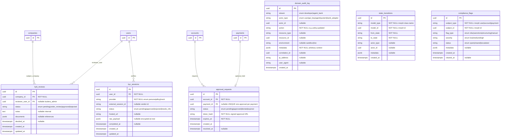

# Budera core ERD — audit, state transitions, compliance stubs (hyper-detail)

```mermaid
%% Budera core ERD — audit, state transitions, compliance stubs (hyper-detail)
erDiagram
    companies {
        uuid id PK
    }

    users {
        uuid id PK
    }

    accounts {
        uuid id PK
    }

    payments {
        uuid id PK
    }

    domain_audit_log {
        uuid id PK
        string stream "enum developer|agent_bank"
        string actor_type "enum user|api_key|agent|system|bank_adapter"
        uuid actor_id "nullable"
        string action "NOT NULL e.g. policy.updated"
        string resource_type "nullable"
        uuid resource_id "nullable"
        string environment "nullable sandbox|live"
        jsonb metadata "NOT NULL arbitrary context"
        uuid correlation_id "nullable"
        string ip_address "nullable"
        string user_agent "nullable"
        timestamptz created_at
    }

    state_transitions {
        uuid id PK
        string model_type "NOT NULL morph class name"
        uuid model_id "NOT NULL morph id"
        string from_state "NOT NULL"
        string to_state "NOT NULL"
        string actor_type "nullable"
        uuid actor_id "nullable"
        jsonb metadata "nullable"
        timestamptz created_at
    }

    kyc_sessions {
        uuid id PK
        uuid user_id FK "NOT NULL"
        string provider "NOT NULL enum persona|alloy|mock"
        string external_session_id "nullable vendor id"
        string status "enum pending|approved|rejected|needs_info"
        string hosted_url "nullable"
        jsonb raw_payload "nullable encrypted-at-rest"
        timestamptz completed_at "nullable"
        timestamptz created_at
        timestamptz updated_at
    }

    kyb_reviews {
        uuid id PK
        uuid company_id FK "NOT NULL"
        uuid reviewer_user_id FK "nullable budera_admin"
        string status "enum pending|under_review|approved|rejected"
        text notes "nullable internal"
        jsonb documents "nullable references"
        timestamptz decided_at "nullable"
        timestamptz created_at
        timestamptz updated_at
    }

    compliance_flags {
        uuid id PK
        string subject_type "NOT NULL morph user|account|payment"
        uuid subject_id "NOT NULL morph id"
        string flag_type "enum ofac|sanctions|structuring|manual"
        string severity "enum low|medium|high"
        string status "enum open|cleared|escalated"
        jsonb metadata "nullable"
        timestamptz created_at
        timestamptz cleared_at "nullable"
    }

    approval_requests {
        uuid id PK
        uuid account_id FK "NOT NULL"
        uuid payment_id FK "nullable UNIQUE one approval per payment"
        string status "enum pending|approved|denied|expired"
        string token_hash "NOT NULL signed approval URL"
        timestamptz expires_at "NOT NULL"
        timestamptz created_at
        timestamptz resolved_at "nullable"
    }

    users ||--o{ kyc_sessions : verifies
    companies ||--o{ kyb_reviews : subject_company
    users ||--o{ kyb_reviews : reviewer_user

    accounts ||--o{ approval_requests : requires
    payments ||--o| approval_requests : optional_hold
```
