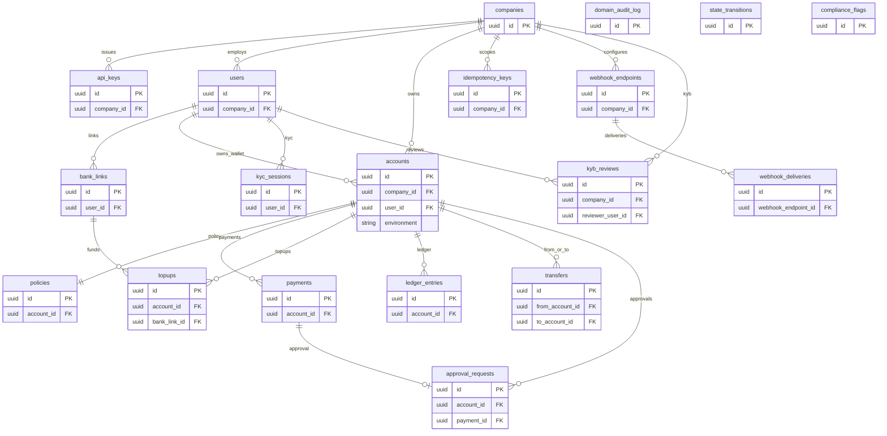

# Budera core ERD — full graph (all entities, minimal attributes)

For column-level detail use [`02-tenancy-and-principals-er.md`](./02-tenancy-and-principals-er.md) through [`08-observability-and-compliance-er.md`](./08-observability-and-compliance-er.md).

